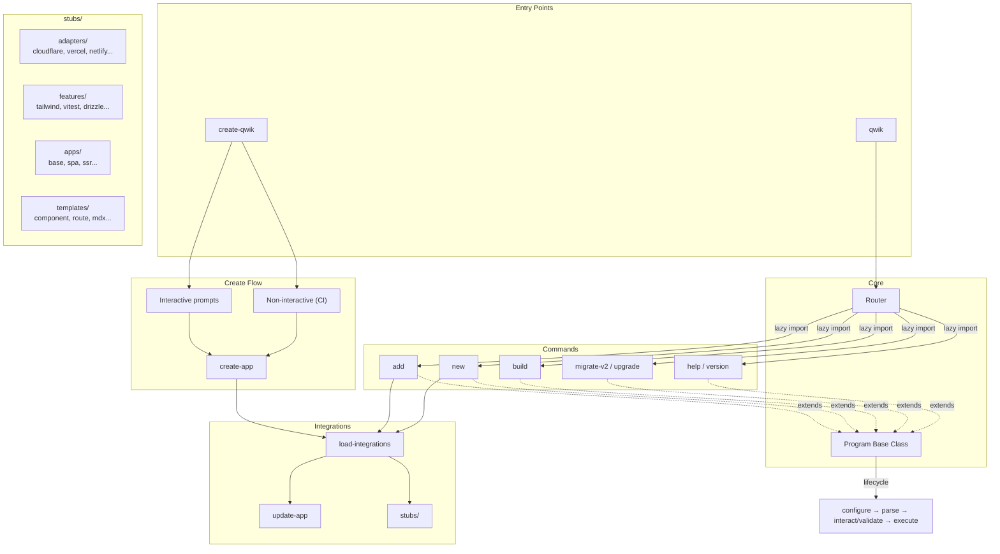

# ⚡ @qwik.dev/cli

The official CLI for creating and managing Qwik projects.

```bash
# Create a new project
pnpm create qwik

# Add an integration
pnpm qwik add tailwind

# Scaffold a component or route
pnpm qwik new component my-button
```

## 📋 Requirements

- Node.js >= 24.0.0

## 🏗️ Architecture



Every command extends `Program<T, U>` which provides a consistent lifecycle: **configure → parse → interact/validate → execute**. Commands are lazy-imported for fast startup.

## 🧑‍💻 Development

```bash
pnpm install
pnpm build        # Build CLI (vp pack)
pnpm test         # Integration tests (Japa)
pnpm test:unit    # Unit tests (Vitest)
pnpm lint         # Lint
pnpm format       # Format
```

## 📁 Project Structure

```
bin/                # CLI entry points
src/
  commands/         # CLI commands (add, new, build, migrate, etc.)
  integrations/     # Loading and applying stubs to user projects
  create-qwik/      # create-qwik scaffolding logic
  core.ts           # Program base class (all commands extend this)
  router.ts         # Command routing with lazy imports
stubs/
  adapters/         # Server deployment targets (cloudflare, vercel, netlify, etc.)
  features/         # Optional integrations (tailwind, vitest, drizzle, etc.)
  apps/             # Starter templates for create-qwik
  templates/        # File generators for `qwik new`
migrations/
  v2/               # v1 → v2 migration pipeline
```

## 🔌 Contributing Stubs

Stubs are the most common contribution. They live in `stubs/adapters/` and `stubs/features/` and are **auto-discovered** — no registration needed. Drop a folder with a `package.json` and it shows up in `qwik add`.

### Adapter vs Feature

- **Adapter** (`stubs/adapters/`): A deployment target. Provides a server entry point and build config. Examples: cloudflare-pages, vercel-edge, node-server.
- **Feature** (`stubs/features/`): An optional integration. Adds tooling, styling, testing, etc. Examples: tailwind, vitest, drizzle.

### Stub Structure

Every stub is a directory with a `package.json` containing a `__qwik__` key. All other files get copied into the user's project when they run `qwik add <id>`.

```
stubs/features/my-feature/
  package.json          # Required: metadata + dependencies
  src/global.css        # Optional: files copied to user's project
  prettier.config.js    # Optional: any config files
```

The directory name becomes the stub ID (what users type in `qwik add <id>`).

### package.json format

A stub's `package.json` has two jobs:

1. **Standard npm fields** (`dependencies`, `devDependencies`, `scripts`) — these get merged into the user's project.
2. **`__qwik__` metadata** — tells the CLI how to present and apply the integration.

**Minimal example** (a feature that just adds a dependency):

```json
{
  "description": "Drizzle ORM",
  "devDependencies": {
    "drizzle-orm": "^0.30.0"
  },
  "__qwik__": {
    "displayName": "Integration: Drizzle ORM"
  }
}
```

That's all you need. `displayName` is what appears in the `qwik add` menu. Priority is derived automatically from the directory — adapters sort above features. You only need to set `priority` if you want to control ordering within the group.

**With Vite plugin injection** (the CLI auto-modifies the user's `vite.config.ts`):

```json
{
  "__qwik__": {
    "displayName": "Integration: Tailwind v4 (styling)",
    "viteConfig": {
      "imports": [{ "defaultImport": "tailwindcss", "importPath": "@tailwindcss/vite" }],
      "vitePlugins": ["tailwindcss()"]
    }
  }
}
```

**With post-install messaging:**

```json
{
  "__qwik__": {
    "displayName": "Adapter: Cloudflare Pages",
    "priority": 40,
    "docs": ["https://qwik.dev/deployments/cloudflare-pages/"],
    "nextSteps": {
      "title": "Next Steps",
      "lines": ["Run `pnpm run build` then `pnpm run deploy`"]
    }
  }
}
```

### `__qwik__` field reference

| Field | Required | Description |
|-------|----------|-------------|
| `displayName` | ✅ | Label in the `qwik add` selection menu |
| `priority` | | Override sort order within group. Default: 20 (adapters), -10 (features) |
| `viteConfig` | | Auto-adds imports and plugins to `vite.config.ts` |
| `docs` | | Documentation URLs shown after install |
| `nextSteps` | | Instructions shown after install |

### Adapter-specific files

Adapters typically include:

```
stubs/adapters/my-adapter/
  package.json
  adapters/my-adapter/vite.config.ts    # Build config
  src/entry.my-adapter.tsx              # Server entry point
  gitignore                             # Merged into .gitignore (no dot prefix)
```

The `scripts` in an adapter's `package.json` get merged into the user's `package.json`:

```json
{
  "scripts": {
    "build.server": "vite build -c adapters/my-adapter/vite.config.ts",
    "deploy": "my-platform deploy ./dist",
    "serve": "my-platform dev ./dist"
  }
}
```

### Testing your stub

Build the CLI and test against a real project:

```bash
pnpm build
node ./dist/bin/qwik.mjs add my-feature
```

Or run the existing integration tests:

```bash
pnpm test
```

## 📄 License

MIT
